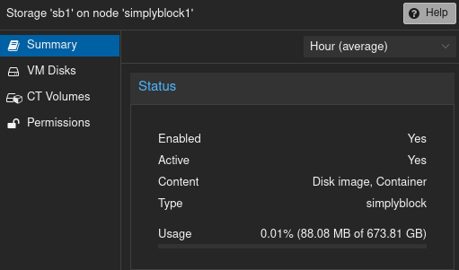

Proxmox Virtual Environment (Proxmox VE) is an open-source server virtualization platform that integrates KVM-based
virtual machines and LXC containers with a web-based management interface.

Simplyblock seamlessly integrates with Proxmox through its storage plugin. The storage plugin enables the automatic
provisioning of storage volumes for Proxmox's KVM virtual machines and LXC containers. Simplyblock is fully integrated
into the Proxmox user interface.

After being deployed, virtual machine and container images can be provisioned to simplyblock logical volumes, inheriting
all performance and reliability characteristics. Volumes provisioned using the simplyblock Proxmox integration are
automatically managed and provided to the hypervisor in an ad-hoc fashion. The Proxmox UI and command line interface can
manage the volume lifecycle.

## Install Simplyblock for Proxmox

Simplyblock's Proxmox storage plugin can be installed from the simplyblock apt repository. To register the simplyblock
apt repository, simplyblock offers a script to handle the repository registration automatically.

!!! info
    All the following commands require root permissions for execution. It is recommended to log in as root or open a
    root shell using `sudo su`. 

```bash title="Automatically register the Simplyblock Debian Repository"
curl https://install.simplyblock.io/install-debian-repository | bash
```

If a manual registration is preferred, the repository public key must be downloaded and made available to apt. This key
is used for signature verification.

```bash title="Install the Simplyblock Public Key"
curl -o /etc/apt/keyrings/simplyblock.gpg https://install.simplyblock.io/simplyblock.key
```

Afterward, the repository needs to be registered for apt itself. The following line registers the apt repository.

```bash title="Register the Simplyblock Debian Repository"
echo 'deb [signed-by=/etc/apt/keyrings/simplyblock.gpg] https://install.simplyblock.io/debian stable main' | \
    tee /etc/apt/sources.list.d/simplyblock.list
```

### Install the Simplyblock-Proxmox Package

After the registration of the repository, an `apt update` will refresh all available package information and make the
`simplyblock-proxmox` package available. The update must not show any errors related to the simplyblock apt repository.

With the updated repository information, an `apt install simplyblock-proxmox` installed the simplyblock storage plugin.

```bash title="Install the Simplyblock Proxmox Integration"
apt update
apt install simplyblock-proxmox
```

Now, register a simplyblock storage pool with Proxmox. The new Proxmox storage can have an arbitrary name and multiple
simplyblock storage pools can be registered as long as their Proxmox names are different.

```bash title="Enable Simplyblock as a Storage Provider"
pvesm add simplyblock <NAME> \
    --entrypoint=<CONTROL_PLANE_ADDR> \
    --cluster=<CLUSTER_ID> \
    --secret=<CLUSTER_SECRET> \
    --pool=<STORAGE_POOL_NAME>
```

| Parameter          | Description                                                                                                                                                                              |
|--------------------|------------------------------------------------------------------------------------------------------------------------------------------------------------------------------------------|
| NAME               | The name of the storage pool in Proxmox.                                                                                                                                                 |
| CONTROL_PLANE_ADDR | The api address of the simplyblock control plane.                                                                                                                                        |
| CLUSTER_ID         | The simplyblock storage cluster id. The cluster id can be found using [`{{ cliname }} cluster list`](../../reference/cli/cluster.md#shows-the-cluster-list).                   |
| CLUSTER_SECRET     | The simplyblock storage cluster secret. The cluster secret can be retrieved using [`{{ cliname }} cluster get-secret`](../../reference/cli/cluster.md#gets-a-clusters-secret). |
| STORAGE_POOL_NAME  | The simplyblock storage pool name to attach.                                                                                                                                             | 

In the Proxmox user interface, a storage of type simplyblock is now available.



The hypervisor is now configured and can use a simplyblock storage cluster as a storage backend.
